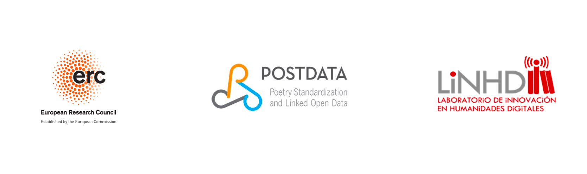

# \#Confinaversos

Súmate a nuestra iniciativa y ayúdanos a crear este recopilatorio sobre el confinamiento. Envíanos tu poema o canción original, en español o inglés.

Todo el contenido que recopilemos se podrá consultar en el espacio github de POSTDATA: https://github.com/linhd-postdata/confinaversos

¡Esperamos que lo disfrutéis!

El equipo de POSTDATA “Poetry Standardization and Linked Open Data”: Proyecto financiado por el Consejo Europeo de Investigación (ERC) dentro del programa Horizonte 2020 de la Unión Europea (grant agreement Nº [679528]).

Todos los poemas aportados conservan sus derechos de autor individuales pero son liberados al público en un repositorio GitHub bajo los términos de una licencia CC-BY 4.0.

# \#Confinedverses

Join our initiative and help us create this compilation about confinement. Send us your original poem or song, in Spanish or English.

All the poems and lyrics we collect will be available in the POSTDATA github:
https://github.com/linhd-postdata/confinaversos

We hope you enjoy it!

The POSTDATA Team, “Poetry Standardization and Linked Open Data”: This project has received funding from the European Research Council (ERC) under the European Union’s Horizon 2020 research and innovation programme (grant agreement Nº [679528]).

All contributed poems retain their individual copyright but are released to the public on a GitHub repository under the terms of a CC-BY 4.0 license.

